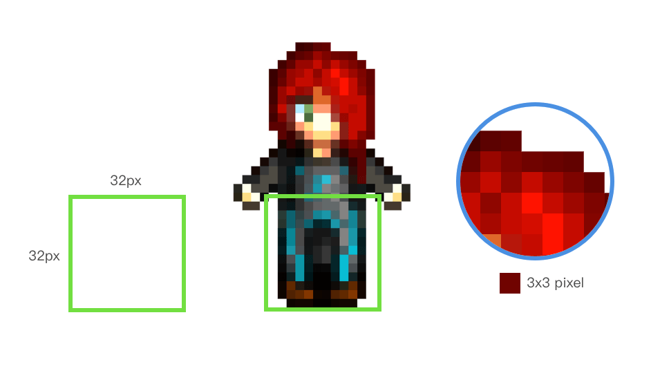

# HTML5 RPG Game

## 使用者故事

* [x] 進入網站需要輸入玩家名稱
  * [x] 名稱格式限定：必須是小寫英文、沒有數字、沒有空格、沒有其他特殊字元
* [x] 輸入玩家名稱後開始遊戲
* [ ] 玩家必須找到 NPC 對話
* [ ] NPC 對話成功遊戲結束

### 玩家

* [ ] 玩家可以移動切換到其他地圖場景

### NPC

* [x] 可以對話

### 物品

### 地圖

* [ ] 可以切換地圖場景

## 材質製作解釋

下載 [PikoPixel](http://twilightedge.com/mac/pikopixel/) 繪製 Pixel Art 工具。

可以開一張 16x16 的 artboard，輸出時選擇 scale 3 增加三倍，物體超出畫格範圍沒有關係，視需求而定。
